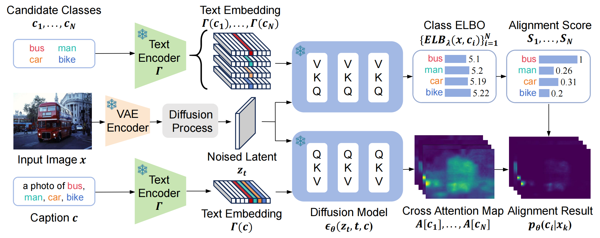

<h1 align='center'>ELBO-T2IAlign: A Generic ELBO-Based Method for Calibrating Pixel-level Text-Image Alignment in Diffusion Models</h1>
<p align="center"> <span style="color:#137cf3; font-family: Gill Sans">Qin Zhou</span>, <span style="color:#137cf3; font-family: Gill Sans">Zhiyang Zhang</span>, <span style="color:#137cf3; font-family: Gill Sans">Jinglong Wang</span>, <span style="color:#137cf3; font-family: Gill Sans">Xiaobin Li</span>, <span style="color:#137cf3; font-family: Gill Sans">Jing Zhang</span><sup>*</sup>, <span style="color:#137cf3; font-family: Gill Sans">Qian Yu</span>, <span style="color:#137cf3; font-family: Gill Sans">Lu Sheng</span>, <span style="color:#137cf3; font-family: Gill Sans">Dong Xu</span> <br> 
<span style="font-size: 16px">Beihang University</span>, <span style="font-size: 16px">University of Hong Kong</span></p>

<div align="center">
  <a href="https://vcg-team.github.io/elbo-t2ialign-webpage/"></a>  
  <a href="https://arxiv.org/abs/2506.09740"></a>  
  <a href="https://github.com/VCG-team/elbo-t2ialign"></a>  
  <a href="https://huggingface.co/datasets/Matrix53/elbo-t2ialign"></a>
</div>
<br>
<p align="center">
  
</p>

## Abstract

Diffusion models excel at image generation. Recent studies have shown that these models not only generate high quality images but also encode text-image alignment information through attention maps or loss functions. This information is valuable for various downstream tasks, including segmentation, text-guided image editing, and compositional image generation. However, current methods heavily rely on the assumption of perfect text-image alignment in diffusion models, which is not the case. In this paper, we propose using zero-shot referring image segmentation as a proxy task to evaluate the pixel-level image and class-level text alignment of popular diffusion models. We conduct an in-depth analysis of pixel-text misalignment in diffusion models from the perspective of training data bias. We find that misalignment occurs in images with small sized, occluded, or rare object classes. Therefore, we propose ELBO-T2IAlign—a simple yet effective method to calibrate pixel-text alignment in diffusion models based on the evidence lower bound (ELBO) of likelihood. Our method is training-free and generic, eliminating the need to identify the specific cause of misalignment and works well across various diffusion model architectures. Extensive experiments on commonly used benchmark datasets on image segmentation and generation have verified the effectiveness of our proposed calibration approach.

## Setup
```bash
# clone repository and install git lfs
git clone https://github.com/VCG-team/elbo-t2ialign
cd elbo-t2ialign
git lfs install
git lfs pull

# create conda env with environment.yaml
conda env create -f environment.yaml
conda activate elbo-t2ialign
python -m spacy download en_core_web_sm

# download datasets from Hugging Face, and link them to project folder
pip install 'huggingface_hub[cli]'
hf download Matrix53/elbo-t2ialign --repo-type=dataset --local-dir ./datasets
```

## Usage

To run segmentation experiment, you can use `./scripts/template_run_segmentation.sh`:
```bash
# You can change arguments in the script below to test different settings(include models/hyperparameters etc.)
# Full arguments are in `configs/run_segmentation.yaml`
./scripts/template_run_segmentation.sh
```

To run composable generation experiment, you can use `./scripts/template_run_generation.sh`:
```bash
# You can change arguments in the script below to test different settings(include models/hyperparameters etc.)
# Full arguments are in `configs/run_generation.yaml`
./scripts/template_run_generation.sh
```

If you just want to visualize a few results, you can use `scripts/run_segmentation.ipynb`(segmentation) and `scripts/run_generation.ipynb`(generation).

Welcome to open an issue if you have any question.

## Credits

We appreciate all open source projects that we use in this project:

- [mmsegmentation](https://github.com/open-mmlab/mmsegmentation), [diffusers](https://github.com/huggingface/diffusers), [transformers](https://github.com/huggingface/transformers)
- [MCTFormer](https://github.com/xulianuwa/MCTformer), [prompt-to-prompt](https://github.com/google/prompt-to-prompt), [clip-es](https://github.com/linyq2117/CLIP-ES)

## Citation
```bibtex
@article{zhou2025elbo,
    title={ELBO-T2IAlign: A Generic ELBO-Based Method for Calibrating Pixel-level Text-Image Alignment in Diffusion Models},
    author={Zhou, Qin and Zhang, Zhiyang and Wang, Jinglong and Li, Xiaobin and Zhang, Jing and Yu, Qian and Sheng, Lu and Xu, Dong},
    journal={arXiv preprint arXiv:2506.09740},
    year={2025}
}
```
